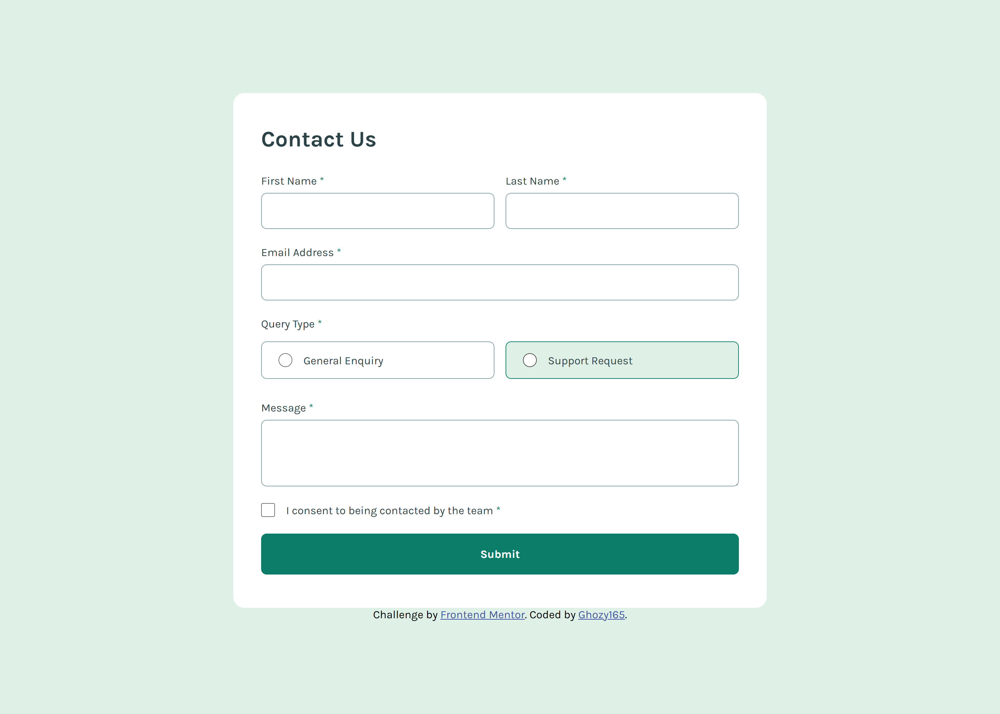

# Frontend Mentor - Contact form solution

This is a solution to the [Contact form challenge on Frontend Mentor](https://www.frontendmentor.io/challenges/contact-form--G-hYlqKJj). Frontend Mentor challenges help you improve your coding skills by building realistic projects. 

## Table of contents

- [Overview](#overview)
  - [The challenge](#the-challenge)
  - [Screenshot](#screenshot)
  - [Links](#links)
- [My process](#my-process)
  - [Built with](#built-with)
  - [What I learned](#what-i-learned)
  - [Continued development](#continued-development)
  - [Useful resources](#useful-resources)
- [Author](#author)
- [Acknowledgments](#acknowledgments)

## Overview

### The challenge

Users should be able to:

- Complete the form and see a success toast message upon successful submission
- Receive form validation messages if:
  - A required field has been missed
  - The email address is not formatted correctly
- Complete the form only using their keyboard
- Have inputs, error messages, and the success message announced on their screen reader
- View the optimal layout for the interface depending on their device's screen size
- See hover and focus states for all interactive elements on the page

### Screenshot

### Links

- Solution URL: [My solution URL](https://github.com/Ghozy165/Contact-form)
- Live Site URL: [My live site URL](https://contact-form-eight-iota.vercel.app)

## My process

### Built with

- Semantic HTML5 markup
- CSS custom properties
- Flexbox
- CSS Grid
- Mobile-first workflow

### What I learned

- Accessibility,
- Semantic HTML
- ARIA
- form validation
- reuseable, maintainable, and readable js code

### Continued development

Must to use WCAG and ARIA for the best structure HTML and make reuseable, maintainable, and readable code 

### Useful resources

- [Responsiveness](https://utopia.fyi/) - This helped me for make responsive web. 
- [guide grid](https://css-tricks.com/snippets/css/complete-guide-grid/) - This help how to use grid

## Author

- Frontend Mentor - [@Ghozy165](https://www.frontendmentor.io/profile/Ghozy165)

## Acknowledgments

Thanks to frontend mentor that give inspiring practices and place to enhance frontend skill